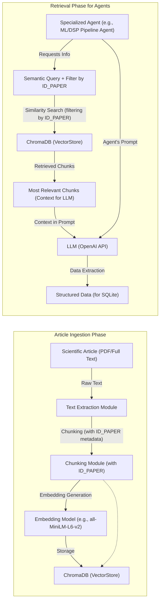

# Multi-Agent System for Systematic Review of Machine Learning in Finance

## Project Overview

This project aims to develop a **robust multi-agent system** to automate and optimize the granular data extraction from scientific articles, specifically in the field of machine learning applied to financial decision-making. The complexity and vast range of information to be extracted, which includes everything from basic metadata to intricate details of ML/DSP pipelines and financial classifications, have rendered the traditional single-prompt approach inefficient and prone to inconsistencies.

To overcome these challenges, we propose a solution that combines:
*   A **multi-agent system** orchestrated by LangGraph, where each agent specializes in a specific part of the data model.
*   A **Retrieval Augmented Generation (RAG) infrastructure**, utilizing a VectorStore (ChromaDB) to allow agents to efficiently and semantically access the most relevant sections of the articles.

## Objectives

*   **Automate Data Extraction**: Reduce reliance on manual extraction, accelerating the systematic review process.
*   **Improve Data Quality and Consistency**: Ensure extracted data is accurate and adheres to the relational model's validation rules.
*   **Optimize LLM Usage**: Utilize semantic retrieval to provide LLMs with only the necessary context, optimizing costs and token limits.
*   **Modularity and Scalability**: Develop a system that is easy to maintain, debug, and extend for future needs.

## Technologies Used

*   **Agent Orchestration**: **LangGraph** (for defining and managing the workflow between agents).
*   **Large Language Models (LLMs)**: **OpenAI API** (for the language processing power of the agents).
*   **Vector Database**: **ChromaDB** (for storing and retrieving embeddings of scientific articles).
*   **Relational Database**: **SQLite** (to persist the extracted structured data, following the 28-table model).
*   **Development Environment**: **Python 3.x** and **VS Code**.
*   **Version Control**: **Git** and **GitHub**.

## Relational Data Model

At the core of this project is a **detailed relational model, implemented in SQLite**, comprising **28 tables**. These tables are designed to capture comprehensive information about papers, authors, institutions, research questions, interventions, machine learning models, pipeline processes, tools used, financial classes involved, and much more. Examples of tables include `PAPER`, `AUTHOR`, `MODEL`, `PIPELINE_STEP`, `FINANCIAL_CLASS`, and `PAPER_INTERVENTION`.

The tables are categorized by population and update frequency:
*   **Static Pre-populated**: Data that does not change during analysis (e.g., `JOURNAL`, `CONFERENCE`, `PUBLISHER`, `JOURNAL_SCORE`, `CONFERENCE_SCORE`).
*   **Quasi-static Pre-populated**: Allow rare additions during analysis (e.g., `MODEL_TASK`, `IO_CATEGORY`, `INTERVENTION`, `FINANCIAL_CLASS`).
*   **Incrementally Updated**: Frequently updated with new entries during analysis (e.g., `PROCESSING`, `TOOL`).
*   **Partially Pre-populated**: The `PAPER` table is pre-populated with basic metadata (`ID`, `TITLE`, `ABSTRACT`, `LANGUAGE`, and library-specific flags like `SCOPUS_DATE`, `WOS_DATE`, etc., derived from `MANUAL_TAGS` in an `.xlsx` file) and then incrementally updated via agents with fields like `PUBLICATION_DATE`, `MULTIMODALITY`, `POPULATION`, `INTERVENTION`, `CONTEXT`, and `OUTCOME`.

## Initial RAG Infrastructure Implementation

The first phase of implementation focuses on building the **RAG infrastructure** for scientific articles:

1.  **Embedding Model Selection**: An embedding model (e.g., `all-MiniLM-L6-v2`) will be selected to convert text chunks into numerical vectors.
2.  **Chunking Strategy**: Articles will be divided into text pieces (`chunks`) with a defined size and overlap. Each `chunk` will be associated with its `ID_PAPER` as metadata to allow for specific filtering.
3.  **ChromaDB Configuration and Population**: The `chunks` and their `embeddings`, along with metadata (including `ID_PAPER`), will be stored in ChromaDB.
4.  **Retrieval Mechanism**: A method will be developed for agents to query the VectorStore, filtering by `ID_PAPER` and retrieving the semantically most relevant `chunks` for a specific query.

## Diagram of Workflow (Initial Prototype)
This diagram represents the main flow of the Base RAG Infrastructure Implementation, showing how articles will be ingested into ChromaDB and how a specialized agent will retrieve information.

### DOT (GraphViz) version:

```dot
digraph RAG_Workflow {
    rankdir=LR; // Layout from Left to Right

    // Nodes for Ingestion Phase
    subgraph cluster_ingestion {
        label = "Article Ingestion Phase";
        style = "filled";
        color = "#e0e0e0";
        node [shape=box, style="filled", fillcolor="#aaddff"];

        A_PDF [label="Scientific Article\n(PDF/Full Text)"];
        B_ExtractText [label="Text Extraction Module"];
        C_Chunking [label="Chunking Module\n(with ID_PAPER)"];
        D_EmbeddingModel [label="Embedding Model\n(e.g., all-MiniLM-L6-v2)"];
        E_ChromaDB_Ingest [label="ChromaDB\n(VectorStore)"];
    }

    // Nodes for Retrieval Phase
    subgraph cluster_retrieval {
        label = "Retrieval Phase for Agents";
        style = "filled";
        color = "#e0e0e0";
        node [shape=box, style="filled", fillcolor="#ffd7aadd"];

        F_Agent [label="Specialized Agent\n(e.g., ML/DSP Pipeline Agent)"];
        G_Query [label="Semantic Query\n+ Filter by ID_PAPER"];
        H_ChromaDB_Retrieve [label="ChromaDB\n(VectorStore)"]; // Reuse node for clarity
        I_RelevantChunks [label="Most Relevant Chunks\n(Context for LLM)"];
        J_LLM_API [label="LLM (OpenAI API)"];
        K_StructuredData [label="Structured Data\n(for SQLite)"];
    }

    // Edges (Flow) for Ingestion Phase
    A_PDF -> B_ExtractText [label=" Raw Text"];
    B_ExtractText -> C_Chunking [label=" Chunking\n(with ID_PAPER metadata)"];
    C_Chunking -> D_EmbeddingModel [label=" Embedding Generation"];
    D_EmbeddingModel -> E_ChromaDB_Ingest [label=" Storage"];
    C_Chunking -> E_ChromaDB_Ingest [label=" ID_PAPER Metadata", style=dotted]; // Show metadata flowing separately or in parallel

    // Edges (Flow) for Retrieval Phase
    F_Agent -> G_Query [label=" Requests Info"];
    G_Query -> H_ChromaDB_Retrieve [label=" Similarity Search\n(filtering by ID_PAPER)"];
    H_ChromaDB_Retrieve -> I_RelevantChunks [label=" Retrieved Chunks"];
    I_RelevantChunks -> J_LLM_API [label=" Context in Prompt"];
    F_Agent -> J_LLM_API [label=" Agent's Prompt", style=dashed]; // Agent provides the prompt to LLM
    J_LLM_API -> K_StructuredData [label=" Data Extraction"];
}
```

### Mermaid version:

